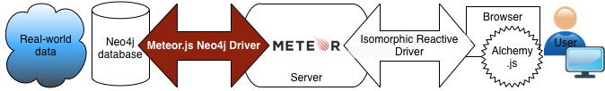

<head>
  <meta charset="utf-8">
  <title>Ostrio-neo4jdriver</title>
  <link rel="stylesheet" type="text/css" href="css/style.css">
  
</head>

<body>

  

    ostr.i<a href="https://gist.github.com/dr-dimitru" target="_blank" class="cursor">o</a>
  

<nav>
<ul>
<li><a href="#top">Overview</a></li>
</ul>
<h2>Installation</h2>
<ul>
<li><a href="#dependencies">Dependencies</a></li>
<li><a href="#installation">Installing the driver</a></li>
<li></li>
</ul>
<h2>Getting started</h2>
<ul>
<li><a href="#connection">Connecting to Neo4j</a></li>
<li><a href="#call">Calling from the client</a></li>
<li><a href="#alchemy">Working with Alchemy</a></li>
<li></li>
</ul>
<h2>API</h2>
<ul>
<li><a href="#Neo4jDB">Neo4jDB()</a></li>
<li><a href="#propertyKeys">db.propertyKeys()</a></li>
<li><a href="#labels">db.labels()</a></li>
<li><a href="#relationshipTypes">db.relationshipTypes()</a></li>
<li><a href="#query">db.query()</a></li>
<li><a href="#queryOne">db.queryOne()</a></li>
<li><a href="#querySync">db.querySync()</a></li>
<li><a href="#queryAsync">db.queryAsync()</a></li>
<li><a href="#graph">db.graph()</a></li>
<li><a href="#cypher">db.cypher()</a></li>
<li><a href="#batch">db.batch()</a></li>
</ul>
</nav>

<main>
<header>
<h1 class="project-tagline">Meteor.js Neo4j Driver (Connector)</h1>
<a href="https://github.com/blackslate/ostrio-neo4jdriver" class="btn">View on GitHub</a>
<a href="https://github.com/blackslate/ostrio-neo4jdriver/zipball/master" class="btn">Download .zip</a>
<a href="https://github.com/blackslate/ostrio-neo4jdriver/tarball/master" class="btn">Download .tar.gz</a>
</header>

<article>
<section id="top">

Imagine a web page that needs to display the relationships between people or things. For example:

<table>
  <tr>
    <td valign="top" width="30%">
<ul>
<li>A social network</li>
<li>Air traffic between airports</li>
<li>An epidemic tracker</li>
<li>A multilingual thesaurus</li>
<li>Your custom project</li>
</ul>
    </td>
    <td width="70%">
    <figure>

<!-- img src="img/ER_Diagram.png" alt="entity-relationship model" / -->

<figcaption>Figure 1. Relationships shown as graphs</figcaption>
</figure>
    </td>
  </tr>
</table>

<!--
source: https://www.flickr.com/photos/notbrucelee/7219422352
author: justgrimes
authorurl: https://www.flickr.com/photos/notbrucelee/
licence_url: https://creativecommons.org/licenses/by-sa/2.0/
licence: (CC BY-SA 2.0)
logo: http://www.wikiartis.com/media/images/licenses/By-sa.png
-->

<!--
source: https://commons.wikimedia.org/wiki/File:ER_Diagram_MMORPG.png
author: TheMattrix
authorurl: 
licence_url: https://creativecommons.org/licenses/by-sa/3.0/deed.en
licence: (CC BY-SA 3.0)
logo: http://www.wikiartis.com/media/images/licenses/By-sa.png
-->

A graph database can help you to visualize the multiple nodes and the links between them, and the <a href="https://github.com/blackslate/ostrio-neo4jdriver">Meteor.js Neo4j Driver</a> can provide a crucial connection between your graph database and the web page.

Your data processing chain might look something like this:
 
 <figure>

 <figcaption>Figure 2. Data processing chain from real world to end user</figcaption>
 </figure>

The Meteor.js Neo4j Driver allows you to connect to a <a href="http://neo4j.com/developer/graph-database/">Neo4j graph database</a> from a <a href="https://www.meteor.com/features">Meteor</a> application. This driver runs only on the server. Internally, it uses the <a href="http://neo4j.com/docs/stable/rest-api.html">Neo4j REST API</a> to interact with a Neo4j database, either on the server itself or on a remote host, such as <a href="http://www.graphenedb.com/docs">GrapheneDB</a>.

In itself, the server-side Neo4j Driver provides no reactivity in the browser. To create a web page that connects to a Neo4j database and updates reactively as the data changes, you should use the <a href="https://github.com/VeliovGroup/ostrio-Neo4jreactivity">Isomorphic Reactive Driver</a>. The Isomorphic Reactive Driver adds a reactive layer to the service provided by the Neo4j Driver. You can use <a href="http://graphalchemist.github.io/Alchemy/#/">Alchemy.js</a> to create dynamic representations of your graph in the browser.

This page can help you understand how to use the Meteor.js Neo4j Driver on the server as part of a Metor project.

<ul>
<li><strong>This is server-side only package, to retrieve data from the client use <a href="http://docs.meteor.com/#/full/meteor_call">call(s)</a> and <a href="http://docs.meteor.com/#/full/meteor_methods">methods</a></strong></li>
<li>This package uses <a href="http://neo4j.com/docs/2.2.5/rest-api-batch-ops.html">batch operations</a> to perform queries. This means that when you send multiple queries to Neo4j in a given event loop, all of them will be executed together as a single batch in the next available event loop.</li>
<li>This package has been tested and works like a charm with <a href="http://www.graphenedb.com/docs">GrapheneDB</a>.</li>
<li>Please see the demo hosted on <a href="/">Meteor (powered by GrapheneDB)</a> and on <a href="/">Heroku</a>.</li>
<li>To learn more about using Cypher, you can start with the <a href="http://neo4j.com/docs/2.2.5/cypher-refcard/">Neo4j cheat sheet</a>.
</section></li>
</ul>

<section>
<h2><a id="dependencies" class="anchor" href="#dependencies" aria-hidden="true"></a>Dependencies</h2>
The Meteor.js Neo4j Driver requires the following applications and modules to be installed. Follow the links for each dependency for detailed installation instructions.

<ul>
<li><a href="https://www.meteor.com/install">Meteor</a></li>
<li><a href="https://nodejs.org/">Node.js</a>, so that you can use npm, the Node Package Manager)</li>
</ul>

You can install the Neo4j database either on the same development computer, or on a remote different server. Alternatively, you can use the online service provided by <a href="http://www.graphenedb.com/docs">GrapheneDB.com</a>. If you are running Neo4j on your own machine, then you will need:

<ul>
<li><a href="https://java.com/en/download/">Java Runtime Environment 1.7 or later</a></li>
<li><a href="http://neo4j.com/download/">Neo4j</a>
</section></li>
</ul>

<section>
<h2><a id="installation" class="anchor" href="#installation" aria-hidden="true"></a>Installating the driver</h2>

Create a new Meteor project, if you don't already have one to work on:

<pre class="prettyprint"><code class="language-none">$meteor create MyProject</code></pre>

Change to your project directory and add the Meteor.js Neo4j Driver:

<pre class="prettyprint"><code class="language-none">$ cd MyProject
$ meteor add ostrio:neo4jdriver</code></pre>

You might like to do a quick smoke test, to check that the driver is correctly installed. The first two commands below create a minimalist JavaScript file which will run on the server as soon as the Meteor environment is ready. The third command launches meteor.

<pre class="prettyprint"><code class="language-none">$ mkdir -p server/lib/
$ cat > server/lib/Neo4jDriver.js &lt;&lt; EOF
'console.log("Meteor.startup: Neo4jDB is a", typeof Neo4jDB)'
EOF
$ meteor</code></pre>

Check in the Terminal window for output that looks like this:

<pre class="prettyprint">=> App running at: http://localhost:3000/
<timestamp>Meteor.startup: Neo4jDB is a function</pre>

If the last word is "function" then all is well.

<section>
<h2><a id="connection" class="anchor" href="#connection" aria-hidden="true"></a>Connecting to Neo4j</h2>

On the server, you want to create a connection to the Neo4j database before any other scripts are loaded. To do this, create a JavaScript file called <code>Neo4jDriver.js</code> at <code><em>MyProject</em>/server/lib/</code> with the following contents. You may need to use your own URL, username and password credentials, as shown in <em>italics</em>.

<pre class="prettyprint">
// Essential: connect to Neo4j server
db = new Neo4jDB(
// Essential: connect to Neo4j server
db = new Neo4jDB(
  "<em>http://localhost:7474</em>"
, { username: "<em>neo4j</em>", password: "<em>1234</em>"}
)

// Optional: check that the database is accessible
cursor = db.query(
  "CREATE " +
  "(hello {name:'Hello'})-[link:LINK]-&gt;(world {props}) " +
  "RETURN hello, link, world"
, { props: { name: 'World' } })
console.log(cursor.fetch())
</pre>

Here's output similar to what you might see in the Terminal window, if all goes well:

<pre class="prettyprint">v2.2.5
Successfully connected to Neo4j on http://localhost:7474
[ { hello: 
     { _service: [Object],
       name: 'Hello',
       id: 6,
       labels: [],
       metadata: [Object] },
    link: 
     { _service: [Object],
       id: 1,
       type: 'LINK',
       metadata: [Object],
       start: '6',
       end: '42' },
    world: 
     { _service: [Object],
       name: 'World',
       id: 42,
       labels: [],
       metadata: [Object] } } ]</pre>

</section>

<section>
<h2><a id="call" class="anchor" href="#call" aria-hidden="true"></a>Calling the Neo4j database from the client</h2>

Content

</section>

<section>
<h2><a id="alchemy" class="anchor" href="#alchemy" aria-hidden="true"></a>Working with Alchemy</h2>

</section>

<section>
<h2><a id="Neo4jDB" class="anchor" href="#Neo4jDB" aria-hidden="true"><code>Neo4jDB([url], [auth])</code></a></h2>
 - <code>url</code> {<em>String</em>} - Absolute URL to Neo4j server, support both <code>http://</code> and <code>https://</code> protocols
 - <code>auth</code> {<em>Object</em>} - User credentials
 - <code>auth.password</code> {<em>String</em>}
 - <code>auth.username</code> {<em>String</em>}
Create <code>Neo4jDB</code> instance and connect to Neo4j
<code>coffeescript
db = new Neo4jDB ';http://localhost:7474';
, 
  username: ';neo4j';
  password: ';1234';
</code>
</section>

<section>
<h2><a id="propertyKeys" class="anchor" href="#propertyKeys" aria-hidden="true"><code>db.propertyKeys()</code></a></h2>
List all property keys ever used in the database. <a href="http://neo4j.com/docs/2.2.5/rest-api-property-values.html">Read more</a>.

Returns an array of strings
</section>

<section>
<h2><a id="labels" class="anchor" href="#labels" aria-hidden="true"><code>db.labels()</code></a></h2>
List all labels ever used in the database. <a href="http://neo4j.com/docs/2.2.5/rest-api-node-labels.html#rest-api-list-all-labels">Read more</a>.

Returns an array of strings
</section>

<section>
<h2><a id="relationshipTypes" class="anchor" href="#relationshipTypes" aria-hidden="true"><code>db.relationshipTypes()</code></a></h2>
List all relationship types ever used in the database. <a href="http://neo4j.com/docs/2.2.5/rest-api-relationship-types.html">Read more</a>.

Returns an array of strings
</section>

<section>
<h2><a id="version" class="anchor" href="#version" aria-hidden="true"><code>db.version()</code></a></h2>

Return version of Neo4j server driver connected to.

Returns string, like <code>2.2.5</code>
</section>

<section>
<h2><a id="query" class="anchor" href="#query" aria-hidden="true"><code>db.query(cypher, [opts], [callback])</code></a></h2>
Send query to Neo4j via transactional endpoint. This Transaction will be immediately committed. This transaction will be sent inside batch, so if you call multiple async queries, all of them will be sent in one batch in closest (next) event loop. <a href="http://neo4j.com/docs/2.2.5/rest-api-transactional.html#rest-api-begin-and-commit-a-transaction-in-one-request">Read more</a>.
 - <code>cypher</code> {<em>String</em>} - Cypher query string
 - <code>opts</code> {<em>Object</em>} - JSON-able map of cypher query parameters
 - <code>callback</code> {<em>Function</em>} - Callback with <code>error</code> and <code>result</code> arguments
 - Returns {<em>Neo4jCursor</em>}

If <code>callback</code> is passed, the method runs asynchronously, instead of synchronously.
<code>coffeescript
db.query "CREATE (n {userData}) RETURN n", userData: username: ';John Black';
</code>
</section>

<section>
<h2><a id="queryOne" class="anchor" href="#queryOne" aria-hidden="true"><code>db.queryOne(cypher, [opts])</code></a></h2>
Returns first result received from Neo4j
 - <code>cypher</code> {<em>String</em>} - Cypher query string
 - <code>opts</code> {<em>Object</em>} - JSON-able map of cypher query parameters
 - Returns {<em>Object</em>}

<pre class="prettyprint"><code class="language-coffeescript">db.queryOne "CREATE (n {userData}) RETURN n", userData: username: ';John Black';
# Returns node as Object:
# {
#   n: {
#     id: 8421,
#     username: "John Black"
#     metadata: {
#       id: 8421,
#       labels": []
#     }
#   }
# }</code></pre>

</section>

<section>
<h2><a id="querySync" class="anchor" href="#querySync" aria-hidden="true"><code>db.querySync(cypher, [opts])</code></a></h2>

Runs alway synchronously
 - <code>cypher</code> {<em>String</em>} - Cypher query string
 - <code>opts</code> {<em>Object</em>} - JSON-able map of cypher query parameters
 - Returns {<em>Neo4jCursor</em>}

<pre class="prettyprint"><code class="language-coffeescript">cursor = db.querySync "CREATE (n {userData}) RETURN n", userData: username: ';John Black';
console.log cursor.fetch()
# Returns array of nodes:
# [{
#   n: {
#     id: 8421,
#     username: "John Black"
#     metadata: {
#       id: 8421,
#       labels": []
#     }
#   }
# }]</code></pre>

</section>

<section>
<h2><a id="queryAsync" class="anchor" href="#queryAsync" aria-hidden="true"><code>db.queryAsync(cypher, [opts], [callback])</code></a></h2>

Runs alway asynchronously, even if callback is not passed
 - <code>cypher</code> {<em>String</em>} - Cypher query string
 - <code>opts</code> {<em>Object</em>} - JSON-able map of cypher query parameters
 - <code>callback</code> {<em>Function</em>} - Callback with <code>error</code> and <code>result</code> arguments
 - Returns {<em>Neo4jCursor</em>}

<pre class="prettyprint"><code class="language-coffeescript">cursor = db.querySync "CREATE (n {userData}) RETURN n", userData: username: ';John Black';
console.log cursor.fetch()
# Returns array of nodes:
# [{
#   n: {
#     id: 8421,
#     username: "John Black"
#     metadata: {
#       id: 8421,
#       labels": []
#     }
#   }
# }]</code></pre>

</section>

<section>
<h2><a id="graph" class="anchor" href="#graph" aria-hidden="true"><code>db.graph(cypher, [opts], [callback])</code></a></h2>
Send query via to Transactional endpoint and return results as graph representation. <a href="http://neo4j.com/docs/2.2.5/rest-api-transactional.html#rest-api-return-results-in-graph-format">Read more</a>.
 - <code>cypher</code> {<em>String</em>} - Cypher query string
 - <code>opts</code> {<em>Object</em>} - JSON-able map of cypher query parameters
 - <code>callback</code> {<em>Function</em>} - Callback with <code>error</code> and <code>result</code> arguments
 - Returns {<em>Neo4jCursor</em>}

If <code>callback</code> is passed, the method runs asynchronously, instead of synchronously.

<pre class="prettyprint"><code class="language-coffeescript">cursor = db.graph "MATCH n RETURN n"
# Actually it is shortcut for:
# db.query
#   query: "MATCH n RETURN n"
#   resultDataContents: ["graph"]
console.log cursor.fetch()
# Returns array of arrays nodes and relationships:
# [{nodes: [{...}, {...}, {...}], relationships: [{...}, {...}, {...}]},
#  {nodes: [{...}, {...}, {...}], relationships: [{...}, {...}, {...}]},
#  {nodes: [{...}, {...}, {...}], relationships: [{...}, {...}, {...}]}]</code></pre>

</section>

<section>
<h2><a id="cypher" class="anchor" href="#cypher" aria-hidden="true"><code>db.cypher(cypher, [opts], [callback])</code></a></h2>

Send query to Neo4j via cypher endpoint. <a href="http://neo4j.com/docs/2.2.5/rest-api-cypher.html">Read more</a>.
 - <code>cypher</code> {<em>String</em>} - Cypher query string
 - <code>opts</code> {<em>Object</em>} - JSON-able map of cypher query parameters
 - <code>callback</code> {<em>Function</em>} - Callback with <code>error</code> and <code>result</code> arguments
 - Returns {<em>Neo4jCursor</em>}

<pre class="prettyprint"><code class="language-coffeescript">cursor = db.cypher "CREATE (n {userData}) RETURN n", userData: username: ';John Black';
console.log cursor.fetch()
# Returns array of nodes:
# [{
#   n: {
#     id: 8421,
#     username: "John Black"
#     metadata: {
#       id: 8421,
#       labels": []
#     }
#   }
# }]</code></pre>

</section>

<section>
<h2><a id="batch" class="anchor" href="#batch" aria-hidden="true"><code>db.batch(tasks, [callback], [reactive], [plain])</code></a></h2>

Sent tasks to batch endpoint, this method allows to work directly with Neo4j REST API. <a href="http://neo4j.com/docs/2.2.5/rest-api-batch-ops.html">Read more</a>.
  - <code>tasks</code> {<em>[Object]</em>} - Array of tasks
  - <code>tasks.$.method</code> {<em>String</em>} - HTTP(S) method used sending this task, one of: ';POST';, ';GET';, ';PUT';, ';DELETE';, ';HEAD';
  - <code>tasks.$.to</code> {<em>String</em>} - Endpoint (URL) for task
  - <code>tasks.$.id</code> {<em>Number</em>} - [Optional] Unique id to identify task. Should be always unique!
  - <code>tasks.$.body</code> {<em>Object</em>} - [Optional] JSONable object which will be sent as data to task
  - <code>callback</code> {<em>Function</em>} - callback function, if present <code>batch()</code> method will be called asynchronously
  - <code>reactive</code> {<em>Boolean</em>} - if <code>true</code> and if <code>plain</code> is true data of node(s) will be updated before returning
  - <code>plain</code> {<em>Boolean</em>} - if <code>true</code>, results will be returned as simple objects instead of <code>Neo4jCursor</code>
  - Returns array of {<em>[Neo4jCursor]</em>}s or array of Object id <code>plain</code> is <code>true</code>

<pre class="prettyprint"><code class="language-coffeescript">batch = db.batch [
  method: "POST"
  to: ';/cypher';
  body: 
    query: "CREATE (n:MyNode {data})"
    params: data: foo: ';bar';
,
  method: "POST"
  to: ';/cypher';
  body: query: "MATCH (n:MyNode) RETURN n"
  id: 999
,
  method: "POST"
  to: ';/cypher';
  body: query: "MATCH (n:MyNode) DELETE n"]

for cursor in batch
  if res._batchId is 999
    cursor.fetch()
</code></pre>
</section>
</body>
</html>